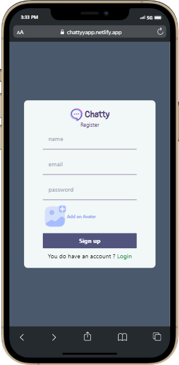
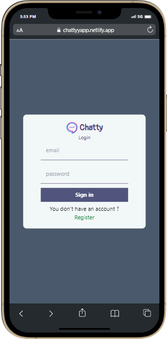
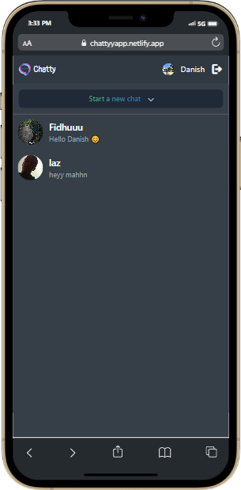
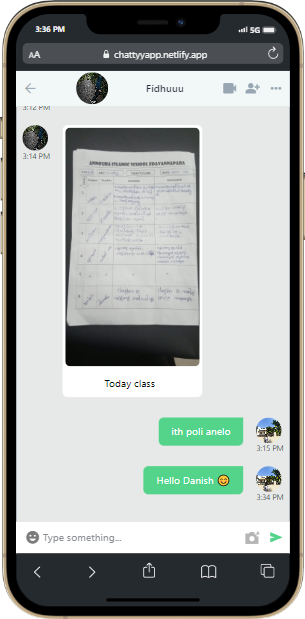
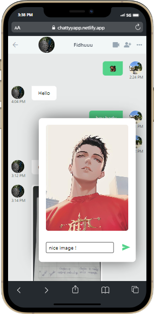
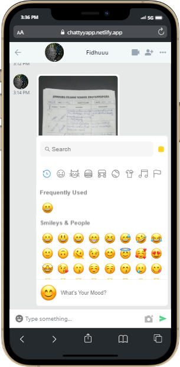

# React.js Project

I made a new project with react.js and firebase . a chat app 'chatty' 🙂


# Chatty(chat app) 


## 🔗 Link

[App Live link](https://chattyyapp.netlify.app/)


## Running Tests

To run tests, run the following command

```bash
  npm start
```


## Screenshots














